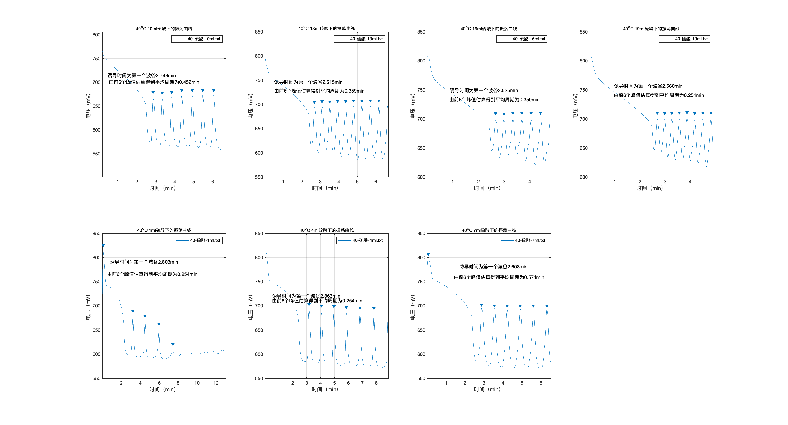
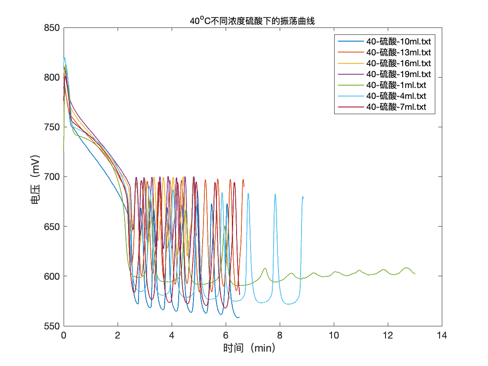

# BZ-Oregonator-
# 为处理实验数据写的小函数

## 结构

---

这个小project包含一个function和两个主函数

*function*

- deal_with.m(实现对于文档中所有的txt进行数据提取）

*two main*

- plot_wav.m(将所有的图在一个图中画出，可用matlab自带的图形处理软件进行微调）
- plot_each.m：
    - 将所有单个图像画入一个大子图内
    - 并且将所要的周期写入‘周期收集.xls',顺序与子图顺序相同
    - 完成寻峰
    - 完成诱导期查找
    - 完成平均周期计算

## 目的

---

完全简化了处理步骤，两个主函数将所有图像处理步骤涵盖

## 如何使用

---

使用该函数你首先有：

- Matlab/octave（后者免费，前者可在学习资源中下载）
- 知道自己数据存储的绝对路径：如：‘/Users/lianbin/Desktop/实验数据/bz/氧化剂+还原剂/45-ox-wyt/’（提示这个为unix/linux路径形式，windous与次不同）

## 之后请放心交给函数

---

步骤一，将三个函数丢入你的数据文件夹（如图）


---

步骤 二，

```matlab
>> plot_wav
>> plot_each
```

well done 处理完成！

### 处理之后有什么

---

plot_wav后

- 出现一张全部配比的大合照

plot_each后

- 包含所有图像的子图
- 一个名叫‘周期收集‘的ecxel表格供你们后期继续使用(顺序与子图顺序一致）

### 处理效果

- single（plot_each)


- zong(plot_wav)

